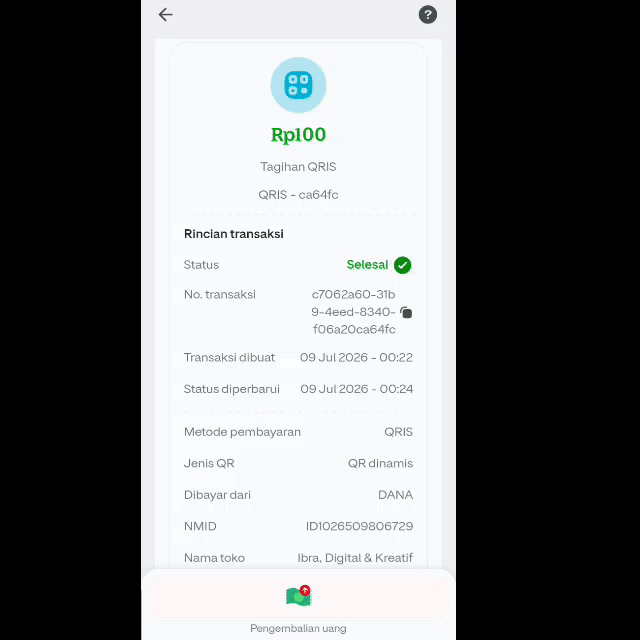

<p align="center">
  
</p>

<h1 align="center">GoPay Merchant CLI</h1>

<p align="center">
  <b>Terima pembayaran QRIS langsung dari terminal.</b><br>
  Generate QRIS, payment link, refund, webhook — semua dalam satu CLI.
</p>

<p align="center">
  <a href="https://t.me/ibracode"></a>
</p>

<br>

---

<br>

<div align="center">
  
</div>

<br>

---

## Fitur

- Generate QRIS dinamis (nominal langsung, customer scan & bayar)
- QRIS statis (customer isi nominal sendiri)
- Payment link + QR code otomatis
- Refund transaksi
- Webhook notifikasi real-time
- Monitor pembayaran dengan progress bar
- Cek mutasi saldo
- Cancel / expire transaksi
- Riwayat transaksi
- Output JSON buat integrasi

Semua bisa dibayar pake DANA, GoPay, OVO, ShopeePay, LinkAja.

---

## Demo

<div align="center">
  
  <br><br>
  
</div>

---

## Yang Didapet

- Source code lengkap CLI
- 16 perintah siap pakai
- Bisa dimodif sesuai kebutuhan
- Dukungan via Telegram
- Update fitur

---

## Cara Pake

```bash
npm install
node . login
node . qris 50000
```

Tiga baris. QRIS siap dipake.

---

## Ada Yang Ingin Ditanyakan?

<BR>

<div align="center">
  <a href="https://t.me/ibracode">
    
  </a>
  <br><br>
  <code>t.me/ibracode</code>
  <br><br>
  <sub>&copy; 2026 Ibra Ramdan</sub>
</div>
