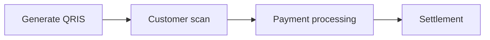
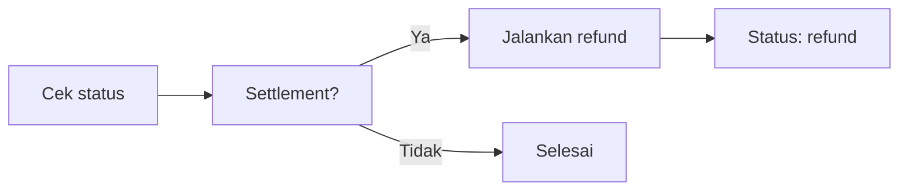

<p align="center">
  
</p>

<h1 align="center">GoPay Merchant CLI</h1>

<p align="center">
  Toolkit CLI untuk mengelola pembayaran merchant langsung dari terminal.<br>
  Mendukung QRIS, Payment Link, transaksi, refund, webhook, dan utilitas merchant lainnya.
</p>

<p align="center">
  <a href="#"></a>
  <a href="#"></a>
  <a href="https://t.me/ibracode"></a>
</p>

---

## Ringkasan

GoPay Merchant CLI adalah antarmuka terminal untuk merchant yang ingin menerima dan mengelola pembayaran digital tanpa harus membuka dashboard atau website. Cukup jalankan satu perintah, QRIS langsung tersedia.

Tool ini mencakup:
- Generate QRIS dinamis dan statis
- Payment Link untuk pembayaran jarak jauh
- Monitoring dan pengecekan status transaksi
- Refund dan pembatalan transaksi
- Webhook server untuk notifikasi real-time
- Riwayat dan mutasi saldo

Target pengguna: developer yang perlu mengintegrasikan pembayaran QRIS ke dalam sistem POS, e-commerce, bot, atau platform mereka sendiri.

---

## Instalasi

```bash
git clone https://github.com/IbraDecode/gopaymerchant.git
cd gopaymerchant
npm install
```

Persyaratan: Node.js 18 atau lebih baru. Tersedia untuk Linux, macOS, dan Windows (via WSL atau Git Bash).

---

## Getting Started

<div align="center">
  
</div>

Proses memulai:

1. Clone repository dan jalankan `npm install`
2. Jalankan aplikasi dengan `node .`
3. Login menggunakan akun merchant
4. Generate QRIS dengan `node . qris 50000`
5. Customer scan dan bayar

Setelah login pertama, konfigurasi tersimpan secara lokal. Aplikasi siap digunakan tanpa perlu login ulang pada sesi berikutnya.

---

## Struktur CLI

| Perintah | Fungsi |
|----------|--------|
| `login` | Login ke akun merchant |
| `qris` | Generate QRIS dinamis |
| `qris static` | Generate QRIS statis |
| `paylink` | Membuat payment link |
| `status` | Cek status transaksi |
| `monitor` | Pantau transaksi real-time |
| `cancel` | Batalkan transaksi pending |
| `expire` | Paksa kadaluwarsa |
| `refund` | Refund transaksi settlement |
| `balance` | Cek mutasi saldo |
| `tx` | Riwayat transaksi |
| `listen` | Menjalankan webhook server |
| `config` | Lihat konfigurasi |

Semua perintah dapat ditambahkan opsi `--json` untuk output terstruktur.

---

## Generate QRIS

<div align="center">
  
</div>

QRIS dinamis digunakan ketika nominal sudah ditentukan. QR yang dihasilkan mengandung jumlah yang harus dibayar. Customer scan dan langsung membayar tanpa perlu memasukkan nominal.

```bash
node . qris 50000
```



Output:

```
  ID Pesanan : QRIS-1783336749362
  Jumlah     : Rp 50.000
  Status     : pending
  Kadaluarsa : 15 menit
  Gambar QR  : https://.../qr-code
```

Gambar QR otomatis tersimpan di `/tmp/gopay_qris_*.png`.

**QRIS Statis:**

```bash
node . qris static
```

QR tanpa nominal. Customer memasukkan jumlah sendiri. Cocok untuk display di kasir atau meja.

**Status transaksi:**

| Status | Keterangan |
|--------|-----------|
| pending | Menunggu pembayaran |
| settlement | Pembayaran diterima |
| cancel | Dibatalkan oleh merchant |
| expire | Kadaluwarsa |
| refund | Dana dikembalikan |
| deny | Ditolak oleh penyedia |

**QRIS + Webhook:**

```bash
node . qris 50000 https://domainkamu.com/webhook
```

Notifikasi dikirim ke URL yang ditentukan saat status berubah.

---

## Payment Link

Payment Link membuat URL pembayaran yang bisa dishare. Setiap link memiliki QR code sendiri. Link dapat dikirim melalui WhatsApp, email, atau media sosial.

```bash
node . paylink 50000
```

```
  Link Bayar : https://example.com/payment-link/...
  QR Code    : https://example.com/v1/payment-links/.../qr-code
```

Link berlaku 60 menit dan dapat digunakan satu kali.

Kapan digunakan: invoice pelanggan, order WhatsApp, pembayaran jarak jauh.

---

## Transaksi

### Cek Status

```bash
node . status QRIS-1783336749362
```

```
  Status     : settlement
  Pembayaran : QRIS
  Jumlah     : Rp 50.000
  Penerbit   : dana
  Waktu      : 2026-07-06 19:21:32
```

### Monitor

Memantau transaksi secara real-time. Aplikasi akan berhenti otomatis saat status berubah menjadi settlement, cancel, expire, atau deny.

```bash
node . monitor QRIS-1783336749362
```

### Riwayat

```bash
node . tx 7
```

Menampilkan daftar transaksi dalam periode tertentu.

---

## Refund

<div align="center">
  
</div>

Refund digunakan untuk mengembalikan dana transaksi yang sudah settlement. Dana dikembalikan ke sumber pembayaran asal.

```bash
node . refund QRIS-1783336749362 50000
```

Syarat: transaksi berstatus settlement.



---

## Webhook

Webhook server menerima notifikasi pembayaran secara real-time. Berguna untuk sistem yang membutuhkan deteksi pembayaran instan tanpa polling berkala.

```bash
node . listen 3000
```

Server berjalan di endpoint `/webhook`. Setiap notifikasi diverifikasi menggunakan signature SHA-512 untuk memastikan keasliannya.

Kombinasikan dengan QRIS:

```bash
node . qris 50000 https://domainkamu.com:3000/webhook
```

Kapan digunakan: e-commerce, top-up otomatis, sistem deposit, atau skenario lain yang membutuhkan notifikasi instan.

---

## Konfigurasi

Konfigurasi disimpan dalam file `config.json` yang dibuat otomatis saat login. File ini berisi data autentikasi yang diperlukan.

File konfigurasi otomatis diabaikan oleh git melalui `.gitignore`.

---

## FAQ

**Apa yang dibutuhkan untuk menggunakan tool ini?**  
Node.js 18+, akun merchant yang terdaftar, dan akses terminal.

**Apakah bisa digunakan untuk production?**  
Tool ini dirancang untuk digunakan pada lingkungan pengembangan maupun produksi sesuai kebutuhan integrasi.

**Apa perbedaan QRIS dan Payment Link?**  
QRIS untuk scan langsung oleh customer. Payment Link untuk dibagikan melalui chat atau email.

**Apa itu status settlement?**  
Status yang menandakan pembayaran telah berhasil diterima dan dana masuk.

**Apakah source code bisa dimodifikasi?**  
Source code lengkap diberikan setelah pembelian.

---

<p align="center">
  <a href="https://t.me/ibracode">t.me/ibracode</a>
</p>
